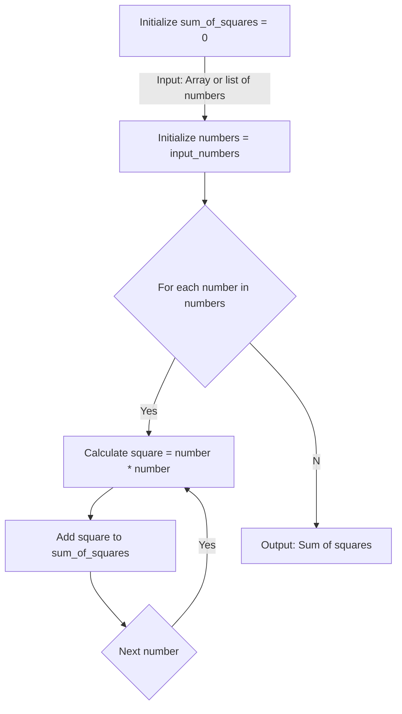

# Sum Of Squares

## Algorithm

Algorithm: SumOfSquares

    <!-- initialize a variable to store sum of squares -->
    sum_of_squares = 0

    <!-- collect numbers -->
    Read numbers

    <!-- iterate through numbers -->
    For each number in inputSet:
        <!-- Calculate square and add to sum_of_squares -->
        square = number * number
        sum_of_squares = sum_of_squares + square

    <!-- display sum -->
    print sum

End Algorithm

## Flowchart

